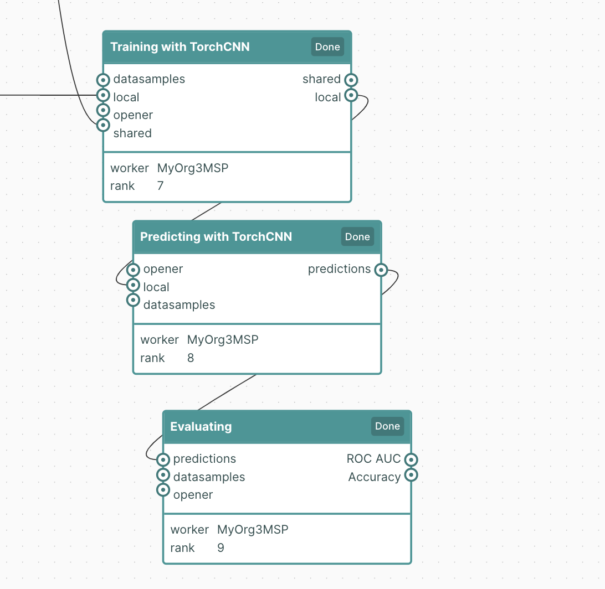
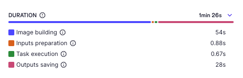

Release notes
=============

.. _compatibility table:

Compatibility table
-------------------

These sets of versions have been tested for compatibility:

.. compatibilitytable:: releases.yaml

.. only:: html

   .. note::

      .. /!\ Path to `docs/build/html/releases.json` is relative to `release.html`

      `JSON version of the release table <../releases.json>`_

Changelog
---------

This is an overview of the main changes, please have a look at the changelog of every repository to have a full grasp on what has changed:

- `substra changelog <https://github.com/Substra/substra/blob/main/CHANGELOG.md>`__
- `substrafl changelog <https://github.com/Substra/substrafl/blob/main/CHANGELOG.md>`__
- `frontend changelog <https://github.com/Substra/substra-frontend/blob/main/CHANGELOG.md>`__
- `substra-tools changelog <https://github.com/Substra/substra-tools/blob/main/CHANGELOG.md>`__
- `backend changelog <https://github.com/Substra/substra-backend/blob/main/CHANGELOG.md>`__
- `orchestrator changelog <https://github.com/Substra/orchestrator/blob/main/CHANGELOG.md>`__

Substra 0.35.0 --- 2024-02-26
^^^^^^^^^^^^^^^^^^^^^^^^^^^^^

**All**

- Remove distributed orchestration mode based on the private blockchain. Starting from this release, only the standalone orchestration mode is supported.
- Functions have now their own lifecycle. They start building when they are created if there is a slot to build it, even if
  the task will be executed later. This speeds up execution time for tasks closer to the end of the workflow. Each function
  is built only once, on the function owner organization. The built image is transferred to other organizations, opening the
  way to have rootless nodes (only one root node with a builder is needed within a network).
- To support the function workflow, the following statuses have been added:

  .. image:: /static/schemes/function.state.svg

- Reworked compute task statuses reflecting status in function:

  .. image:: /static/schemes/computetask.state.svg

Substra 0.34.0 --- 2023-10-18
^^^^^^^^^^^^^^^^^^^^^^^^^^^^^

**All:**

- Add Python 3.11 support.

**Documentation:**

- Example install torch on CPU only by default when using the docker or remote mode.

**Operations**:

- **BREAKING CHANGE**: A database upgrade **must be performed manually**. See :ref:`upgrade notes <ops upgrade notes 0.34>`.

Substra 0.33.1 --- 2023-10-09
^^^^^^^^^^^^^^^^^^^^^^^^^^^^^

**Documentation:**

- Fixed missing dependency in Titanic example when running in docker or remote mode.

Substra 0.33.0 --- 2023-10-06
^^^^^^^^^^^^^^^^^^^^^^^^^^^^^

**Substra:**

- **BREAKING**: Substra tools now only provides a unique base docker image for each supported Python version. The ``minimal`` and the ``workflow`` versions have been removed.

**Documentation:**

- A new development profile is available to deploy a third organization. See `Local deployment <https://docs.substra.org/en/stable/how-to/developing-substra/local-deployment.html#launching>`__ for more details.

Substra 0.32.0 --- 2023-09-08
^^^^^^^^^^^^^^^^^^^^^^^^^^^^^

- Update Substra to Pydantic 2.3.0. Concerned components by the update are SusbtraFL, Substra, Substra-backend and Substra-tests.

Substra 0.31.0 --- 2023-09-07
^^^^^^^^^^^^^^^^^^^^^^^^^^^^^

**SubstraFL:**

- **BREAKING**: `local_dependencies` is renamed `local_installable_dependencies`.
- Python dependencies can be resolved using pip compile during function registration by setting `compile` to `True` in the `Dependency` object. This will speed-up the docker image build phase when running on a Substra server but will slow down a bit the compute plan registration.

  .. code-block:: python

    Dependency(
      pypi_dependencies=["pytest", "numpy"],
      compile=True,
    )

- `random.seed` , `np.random.seed` and `torch.manual_seed`  are now set, saved & load in `TorchAlgo`
- When using `clean_models=True`, the tasks outputs of the very last round are now saved.****

**Substra**:

- Added  `wait_completion` parameter on `get_performances`, `list_task_output_assets` and `get_task_output_asset` to block execution until task execution is over.
- On Client login:
    - Fixes issue where the session would not actually last the 24 hours intended.
    - Added new `Client.logout` function, mirroring `Client.login`
    - `Client` can now be used within a context manager

    .. code-block:: python

      with Client(
        client_name="org-1",
        backend_type="remote",
        url="http://substra-backend.org-1.com:8000",
        username="org-1",
        password="p@sswr0d44",
      ) as client:
        pass

**Web application**

- Fix issue where cancel CP button was not usable on workflow page
- Task duration displayed in task drawer and not only the start and end time.
- Increase the number of tasks displayable in frontend workflow from 1000 to 5000 tasks

Substra 0.30.0 --- 2023-07-27
^^^^^^^^^^^^^^^^^^^^^^^^^^^^^

**Substra:**

- Added ``wait_task`` and ``wait_compute_plan`` function to block execution until task or compute plan execution is over.
- Configuration file path can be set with env var ``SUBSTRA_CLIENTS_CONFIGURATION_FILE_PATH`` .
- Pin ``pydantic`` to ``>=1.9.0`` & ``<2.0.0`` as ``pydantic`` v ``2.0.0`` has been released with a lot of non backward compatible changes.

**SubstraFL:**

- **BREAKING CHANGE:** Input and output of aggregate tasks, used to be ``model`` and are now ``shared_state``. It provides more flexibility to link different type of tasks with each other.
- **BREAKING CHANGE:** Removed function ``wait`` in ``utils``. You can use ``substra.Client.wait_task`` & ``substra.Client.wait_compute_plan`` instead to wait for the completion of a task or a CP.
- Fixed Compatibility with GPU devices when running torch based experiments.
- Pin ``pydantic`` to ``>=1.9.0`` & ``<2.0.0`` as ``pydantic`` v ``2.0.0`` has been released with a lot of non backward compatible changes.

**Web application:**

- Fix issue where only the first 1000 data points where shown in performance graph.
- User validation approval: this new feature (disabled by default) enable Substra admins to validate or reject new users that login with the SSO. Before the validation new user can not do nor see anything on Substra. To setup this feature have a look at `the SSO documentation <https://docs.substra.org/en/stable/operations/howto/sso-oidc.html#set-up-user-creation>`__.

**Documentation**:

- `New example <https://docs.substra.org/en/stable/substrafl_doc/examples/go_further/run_diabetes_substrafl.html#sphx-glr-substrafl-doc-examples-go-further-run-diabetes-substrafl-py>`__ on Federated Analytics with SubstraFL
- `New example <https://docs.substra.org/en/stable/substrafl_doc/examples/go_further/run_mnist_cyclic.html#sphx-glr-substrafl-doc-examples-go-further-run-mnist-cyclic-py>`__ on how to implement a custom cyclic Strategy with SubstraFL.

Substra 0.29.0 --- 2023-06-30
^^^^^^^^^^^^^^^^^^^^^^^^^^^^^

**SubstraFL**:

- **BREAKING CHANGE**: In ``substrafl.model_loading`` the following methods have been renamed:

  - ``download_shared_state`` is now ``download_train_shared_state``
  - ``download_aggregated_state`` is now ``download_aggregate_shared_state``

- Update **numpy** dependency to ``numpy<1.24`` in order to keep pickle compatibility with substra-tools' **numpy** version

**Web application**:

- In performance view, ``Rounds`` is now the default for X-axis
- In task duration, fix issue were `Task execution` and `Outputs saving` durations were inverted

**Documentation**:

- Improve permissions page
- Add ``shared_state`` and ``local_state`` definition in `SubstraFL Overview <https://docs.substra.org/en/stable/substrafl_doc/substrafl_overview.html#local-and-shared-states>`__
- Add ``rank`` definition in `Substra Concepts <https://docs.substra.org/en/stable/documentation/concepts.html#rank>`__

Substra 0.28.1 —-- 2023-09-11
^^^^^^^^^^^^^^^^^^^^^^^^^^^^^

Bump SubstraFL to 0.37.3 to pin Pydantic < 2.0.0 and to always keep last tasks output in remote mode, even with ``clean_models`` to ``True`` in ``execute_experiment``.
Bump Substra to 0.45.1 to pin Pydantic < 2.0.0.

Substra 0.28.0 --- 2023-06-14
^^^^^^^^^^^^^^^^^^^^^^^^^^^^^

**SubstraFL**:

- On how to **decrease** Docker image size to accelerate the compute plan speed:

  - Add ``excluded_paths`` and ``excluded_regex`` parameters to the ``Dependency`` object to exclude file when building the ``Dependency`` object. Defaults are provided to avoid creating large Docker images.

- On **Federated Analytics** and creating **custom FL strategies**:

  - Add ``ComputePlanBuilder`` base class to define which method are needed to implement a custom strategy in SubstraFL. These methods are ``build_compute_plan``, ``load_local_states``and ``save_local_states``.
  - **BREAKING CHANGE**: rename ``build_graph`` to ``build_compute_plan``.
  - **BREAKING CHANGE**: move ``schema.py`` to ``strategy/schema.py``.

.. code-block:: python

  from substrafl.schemas import FedAvgSharedState
  # Become
  from substrafl.strategies.schemas import FedAvgSharedState

**Substra**:

- Fix issue on the ordering when sorting assert (for instance on the ``list_task()`` function).

**Web application**:

- Fix issue where hyper-parameters were not nicely shown when their names was too big.
- The API tokens management has now a **new page** supporting multiple token per user - see - `documentation <https://docs.substra.org/en/latest/documentation/api_tokens_generation.html>`__.
- Reset the selected Compute Plan after a logout.

**Operations**:

- **BREAKING CHANGE**: Substra backend and orchestrator can now use **external database** rather having to use the one packaged as a subchart. See :ref:`upgrade notes <ops upgrade notes 0.28>`.

Substra 0.27.0 --- 2023-05-11
^^^^^^^^^^^^^^^^^^^^^^^^^^^^^

**SubstraFL**:

- **BREAKING CHANGE**: SubstraFL used to create one task per metric. Now all metrics are executed into a single task. This will lead to less tasks for a given CP and will improve compute time.
- **BREAKING CHANGE**: Metrics are now given as ``metric_functions`` and not as ``metric_key``. The functions given as metric functions to test data nodes are automatically registered in a new Substra function by SubstraFL.
  The new argument of the TestDataNode class ``metric_functions`` replaces the ``metric_keys`` one and accepts a dictionary (using the key as the identifier of the function given as value), a list of functions or directly a function if there is only one metric to compute (``function.__name__`` is then used as identifier).
  Installed dependencies are the  `algo_dependencies` passed to ``execute_experiment``, and permissions are the same as the predict function.

  The metric registration changes from:

.. code-block:: python

  def accuracy(datasamples, predictions_path):
    y_true = datasamples["labels"]
    y_pred = np.load(predictions_path)

    return accuracy_score(y_true, np.argmax(y_pred, axis=1))

  metric_deps = Dependency(pypi_dependencies=["numpy==1.23.1", "scikit-learn==1.1.1"])

  permissions_metric = Permissions(public=False, authorized_ids=DATA_PROVIDER_ORGS_ID)

  metric_key = add_metric(
      client=client,
      metric_function=accuracy,
      permissions=permissions_metric,
      dependencies=metric_deps,
  )

  test_data_nodes = [
      TestDataNode(
          organization_id=org_id,
          data_manager_key=dataset_keys[org_id],
          test_data_sample_keys=[test_datasample_keys[org_id]],
          metric_keys=[metric_key],
      )
      for org_id in DATA_PROVIDER_ORGS_ID
  ]

to:

.. code-block:: python

  def accuracy(datasamples, predictions_path):
    y_true = datasamples["labels"]
    y_pred = np.load(predictions_path)

    return accuracy_score(y_true, np.argmax(y_pred, axis=1))

  test_data_nodes = [
      TestDataNode(
          organization_id=org_id,
          data_manager_key=dataset_keys[org_id],
          test_data_sample_keys=[test_datasample_keys[org_id]],
          metric_functions={"Accuracy": accuracy},
      )
      for org_id in DATA_PROVIDER_ORGS_ID
  ]

- Enforce **kwargs** for functions with more than 3 parameters.
- Add the **Federated Principal Component Analysis strategy**.

**Substra**:

- Substra Clients can now be configured using environment variables or a configuration Yaml file.
- **BREAKING CHANGE**: default backend type for Client is now ``subprocess``.

**Web application**:

- Display function name for each task in workflow & tasks table.
- Better performances for workflow.
- Serialize the performance graph regarding the identifier only.

Substra 0.26.3 --- 2023-04-21
^^^^^^^^^^^^^^^^^^^^^^^^^^^^^

- Backend fixes to improve (kaniko pods) stability

Substra 0.26.2 --- 2023-04-19
^^^^^^^^^^^^^^^^^^^^^^^^^^^^^

- Fix Binder build for documentation examples
- Add hardware requirements documentation

Substra 0.26.1 --- 2023-04-11
^^^^^^^^^^^^^^^^^^^^^^^^^^^^^

- Optimising the Dockerfiles generated by SubstraFL for faster image builds

Substra 0.26.0 --- 2023-04-03
^^^^^^^^^^^^^^^^^^^^^^^^^^^^^

- Improve backend performance when handling large amounts of compute plans and tasks. This will result in faster front-end pages.
- Rename Algo to Function.
- SSO Login
- Experimental: Add a task duration breakdown for every task in the front-end. Note that this is an experimental feature and only works on the current backend you are logged into.

Front-end:

- Fix issue where a performance of ``0`` was displayed as ``-``.

SubstraFL:

- **BREAKING CHANGE**: ``algo`` are now passed as a parameter to the ``strategy`` and not to ``execute_experiement`` anymore.
- **BREAKING CHANGE**: a ``strategy`` needs to implement a new method ``build_graph`` to build the graph of tasks to be executed in ``execute_experiment``.
- **BREAKING CHANGE**: ``predict`` method of ``strategy`` has been renamed to ``perform_predict``.
- **BREAKING CHANGE**: clarify ``EvaluationStrategy`` arguments: change ``rounds`` to ``eval_frequency`` and ``eval_rounds``.
- Fix an issue where ``aggregation_lr`` could not be changed in the Scaffold strategy.
- Add Initialization task to each strategy in SubstraFL

Substra 0.25.0 --- 2023-02-17
^^^^^^^^^^^^^^^^^^^^^^^^^^^^^

- **BREAKING CHANGE**: ``DataSampleSpec`` does not have a ``test_only`` field anymore.
- SubstraFL: It is now possible to test on an organization where no training have been performed.
- New ``creator`` field in Compute Plan.
- Fix an issue where Skaffold spawned too many backends.
- Add contributing guide & code of conduct to all repos.

Substra 0.24.0 --- 2023-01-13
^^^^^^^^^^^^^^^^^^^^^^^^^^^^^

- Fix issue where launching a large compute sometimes fails with: ``ERROR: could not serialize access due to read/write dependencies among transactions (SQLSTATE 40001)``
- Documentation: add **contributing guide** and **code of conduct**
- Update **Substra Tools** base docker image to ``substra-tools:0.20.0-nvidiacuda11.6.0-base-ubuntu20.04-python3.*``

Substra 0.23.1 --- 2022-11-24
^^^^^^^^^^^^^^^^^^^^^^^^^^^^^

Main changes

- **BREAKING CHANGE**: replace the tasks ``traintuple``, ``aggregatetuple``, ``predicttuple``, ``testtuple``, ``composite_traintuple`` with a single task.

.. code-block:: python

  task_key = client.add_task(
      substra.schemas.TaskSpec(
          algo_key=algo_key,
          worker=client.organization_info().organization_id,  # org on which the task is executed
          inputs=[
              {
                  'identifier': 'datasamples',
                  'asset_key': datasample_key
              },
              {
                  'identifier': 'opener',
                  'asset_key': dataset_key
              }
          ],
          outputs= {
              'example_output': {
                  'permissions': {
                      'public': False,
                      'authorized_ids': ['org1'],
                  },
                  'is_transient': True,
              }
          }
      )
  )

  task = client.get_task(task_key)
  tasks = client.list_task()

  # Compute plan changes
  compute_plan = client.add_compute_plan(
      substra.schemas.ComputePlanSpec(
          name = 'my compute plan',
          tasks = [
              schemas.ComputePlanTaskSpec(
                  task_id=uuid.uuid4(),
                  algo_key=algo_key,
                  worker=client.organization_info().organization_id,  # org on which the task is executed
                  inputs=[
                      {
                          'identifier': 'datasamples',
                          'asset_key': datasample_key
                      },
                      {
                          'identifier': 'opener',
                          'asset_key': dataset_key
                      }
                  ],
                  outputs= {
                      'example_output': {
                          'permissions': {
                              'public': False,
                              'authorized_ids': ['org1'],
                          },
                          'is_transient': True,
                      }
                  }
              )
          ]
      )
  )

SubstraFL

- The **metric registration** is simplified. The user can now directly write a **metric function** within their script, and directly register it by specifying the right **dependencies** and **permissions**. The **metric function** must have (``datasamples``, ``predictions_path``) as signature.

Example of new metric registration:

.. code-block:: python

  metric_deps = Dependency(pypi_dependencies=["numpy==1.23.1"])
  permissions_metric = Permissions(public=True)

  def mse(datasamples, predictions_path):
      y_true = datasamples["target"]
      y_pred = np.load(predictions_path)
      return np.mean((y_true - y_pred)**2)

  metric_key = add_metric(
      client=substra_client,
      permissions=permissions_metric,
      dependencies=metric_deps,
      metric_function=mse,
  )

- The round 0 is now **exposed**. Possibility to evaluate centralized strategies before any training (FedAvg, NR, Scaffold). The round 0 is **skipped** for single org strategy and cannot be evaluated before training.
- Add support for **Python 3.10**.
- **Local dependencies** are installed in one pip command to optimize the installation and avoid incompatibilities error.
- Fix error when installing **current package** as **local dependency**.

Substra:

- Add **Windows compatibility** for Docker mode.
- **BREAKING CHANGE** remove category from ``substra.schema.AlgoSpec`` and ``substra.models.Algo``

Web application:

- Add **documentation link** in user menu.
- Removed **task categories** from the frontend.
- Renamed any tuple thing into a task thing.
- Check for *last admin* when editing a user.
- **Build error logs** are now accessible given the right permissions.

Substra-Tools:

- Update **Substra Tools** base docker image to ``substra-tools:0.19.0-nvidiacuda11.6.0-base-ubuntu20.04-python3.*``
- **BREAKING CHANGE**: register functions to substratools is done with a decorator.

.. code-block:: python

  class MyAlgo:
    def my_function1:
        pass

    def my_function2:
        pass

  if __name__ == '__main__':
    tools.algo.execute(MyAlgo())

become

.. code-block:: python

  @tools.register
  def my_function1:
    pass

  @tools.register
  def my_function2:
    pass

  if __name__ == '__main__':
    tools.execute()

Substra backend:

- Prevent use of ``__`` in asset metadata keys

Substra 0.22.0 --- 2022-10-20
^^^^^^^^^^^^^^^^^^^^^^^^^^^^^

Main changes

- **BREAKING CHANGE**: the backend type is now set in the ``Client``, the env variable ``DEBUG_SPAWNER`` is not used anymore. Default value is deployed.

before:

.. code-block:: python

  export DEBUG_SPAWNER=subprocess
  client = substra.Client(debug=True)

after:

.. code-block:: python

  client = substra.Client(backend_type=substra.BackendType.LOCAL_SUBPROCESS)

- **BREAKING CHANGE**: ``schemas.ComputePlanSpec.clean_models`` property is now removed, the ``transient`` property on tasks outputs should be used instead.
- **BREAKING CHANGE**: ``Model.category`` field has been removed.
- **BREAKING CHANGE**: ``train`` and ``predict`` methods of all SubstraFL algos now takes datasamples as argument instead of X and y. This is impacting the user code only if he or she overwrite those methods instead of using the ``_local_train`` and ``_local_predict`` methods.
- **BREAKING CHANGE**: The result of the ``get_data`` method from the opener is automatically provided to the given dataset as ``__init__`` arg instead of x and y within the ``train`` and ``predict`` methods of all ``TorchAlgo`` classes. The user dataset should be adapted accordingly:

.. code-block:: python

  from torch.utils.data import Dataset

  class MyDataset(Dataset):
      def __init__(self, x, y, is_inference=False) -> None:
          ...

  class MyAlgo(TorchFedAvgAlgo):
      def __init__(
          self,
      ):
          torch.manual_seed(seed)
          super().__init__(
              model=my_model,
              criterion=criterion,
              optimizer=optimizer,
              index_generator=index_generator,
              dataset=MyDataset,
          )

should be replaced with

.. code-block:: python

  from torch.utils.data import Dataset

  class MyDataset(Dataset):
      def __init__(self, datasamples, is_inference=False) -> None:
          ...

  class MyAlgo(TorchFedAvgAlgo):
      def __init__(
          self,
      ):
          torch.manual_seed(seed)
          super().__init__(
              model=my_model,
              criterion=criterion,
              optimizer=optimizer,
              index_generator=index_generator,
              dataset=MyDataset,
          )

- **BREAKING CHANGE**: ``Algo.category``: do not rely on categories anymore, all algo categories will be returned as ``UNKNOWN``.
- **BREAKING CHANGE**: Replaced ``algo`` by ``algo_key`` in ComputeTask.

GUI

- Improved user management: the last admin cannot be deleted anymore.

Substra

- Algo categories are not checked anymore in local mode. Validations based on inputs and outputs are sufficient.
- Pass substra-tools arguments via a file instead of the command line. This fixes an issue where compute plan would not run if there was too many data samples.

SubstraFL

- NOTABLE CHANGES due to breaking changes in substra-tools:

  - The opener only exposes ``get_data`` and ``fake_data`` methods.
  - The results of the above method is passed under the datasamples keys within the inputs dict arg of all tools methods (``train``, ``predict``, ``aggregate``, ``score``).
  - All method (``train``, ``predict``, ``aggregate``, ``score``) now takes a task_properties argument (``dict``) in addition to inputs and outputs.
  - The rank of a task previously passed under the rank key within the inputs is now given in the ``task_properties`` dict under the rank key.

This means that all opener.py file should be changed from:

.. code-block:: python

  import substratools as tools

  class TestOpener(tools.Opener):
      def get_X(self, folders):
        ...

      def get_y(self, folders):
        ...

      def fake_X(self, n_samples=None):
        ...

      def fake_y(self, n_samples=None):
        ...

to:

.. code-block:: python

  import substratools as tools

  class TestOpener(tools.Opener):
      def get_data(self, folders):
        ...

      def fake_data(self, n_samples=None):
        ...

This also implies that metrics has now access to the results of ``get_data`` and not only ``get_y`` as previously. The user should adapt all of his metrics file accordingly e.g.:

.. code-block:: python

  class AUC(tools.Metrics):
      def score(self, inputs, outputs):
          """AUC"""
          y_true = inputs["y"]
          ...

      def get_predictions(self, path):
          return np.load(path)

  if __name__ == "__main__":
      tools.metrics.execute(AUC())

could be replace with:

.. code-block:: python

  class AUC(tools.Metrics):
      def score(self, inputs, outputs, task_properties):
          """AUC"""
          datasamples = inputs["datasamples"]
          y_true = ... # getting target from the whole datasamples

      def get_predictions(self, path):
          return np.load(path)

  if __name__ == "__main__":
      tools.metrics.execute(AUC())

Substra 0.21.0 --- 2022-09-12
^^^^^^^^^^^^^^^^^^^^^^^^^^^^^

This is our first open source release since 2021! When the product was closed source it used to be named Connect. It is now renamed Substra.

Main changes

- Admin and user roles have been introduced. The user role is the same as the previous role. The admin role can, in addition, manage users and define their roles. The admin can create users and reset their password in the GUI.
- **BREAKING CHANGE**: remove the shared local folder of the compute plan
- **BREAKING CHANGE**: pass the algo method to execute under the ``--method-name`` argument within the within the cli of the task execution. If the interface between substra and the backend is handled via substratools, there are no changes to apply within the substra code but algo and metric ``Dockerfiles`` should expose a ``--method-name`` argument in the ``ENTRYPOINT``.
- **BREAKING CHANGE**: an extra argument ``predictions_path`` has been added to both ``predict`` and ``_local_predict`` methods from all ``TorchAlgo`` classes. The user now have to use the ``_save_predictions`` method to save its predictions in ``_local_predict``. The user defined metrics will load those saved prediction with ``np.load(inputs['predictions'])``. The ``_save_predictions`` method can be overwritten.

Default ``_local_predict`` method from SubstraFL algorithms went from:

.. code-block:: python

  def _local_predict(self, predict_dataset: torch.utils.data.Dataset):
          if self._index_generator is not None:
              predict_loader = torch.utils.data.DataLoader(predict_dataset, batch_size=self._index_generator.batch_size)
          else:
              raise BatchSizeNotFoundError(
                  "No default batch size has been found to perform local prediction. "
                  "Please overwrite the _local_predict function of your algorithm."
              )

          self._model.eval()

          predictions = torch.Tensor([])
          with torch.inference_mode():
              for x in predict_loader:
                  predictions = torch.cat((predictions, self._model(x)), 0)

          return predictions

to

.. code-block:: python

  def _local_predict(self, predict_dataset: torch.utils.data.Dataset, predictions_path: Path):

        if self._index_generator is not None:
            predict_loader = torch.utils.data.DataLoader(predict_dataset, batch_size=self._index_generator.batch_size)
        else:
            raise BatchSizeNotFoundError(
                "No default batch size has been found to perform local prediction. "
                "Please overwrite the _local_predict function of your algorithm."
            )

        self._model.eval()

        predictions = torch.Tensor([])
        with torch.inference_mode():
            for x in predict_loader:
                predictions = torch.cat((predictions, self._model(x)), 0)

        self._save_predictions(predictions, predictions_path)

        return predictions

GUI

- GUI: the page size has been increased from 10 to 30 items displayed
- GUI: Fixed: keep filtering/ordering setup when refreshing an asset list page
- GUI: Fixed: filtering on compute plan duration
- GUI: Fixed: the columns ``name``, ``status`` and ``dates`` are displayed by default in the compute plans page
- GUI: Fixed: broken unselection of compute plans in comparison page
- GUI: Fixed: CP columns and favorites disappear on logout
- GUI: the CP workflow graph now displays CPs with up to 1000 tasks, instead of 300
- The test task rank now have the same behaviour as for other tasks (parent task rank + 1)

Substra

- added ``list_model`` to the SDK client
- Download function of the client return the path of downloaded file
- Local mode: add a check, a task output of type performance must have public permissions
- Fix the filters on status for compute plans and tasks. This fix also introduces some changes: the value for the filters on status must now be a list (like for other filters, there is a OR condition between elements of the list) and its value must be ``substra.models.ComputePlanStatus.{name of the status}.value`` for compute plans and ``substra.models.Status.{name of the status}.value`` for tasks.

  Example:

.. code-block:: python

  # Return all the composite traintuples with the status "doing"
  client.list_composite_traintuple(filters={"status": [substra.models.Status.doing.value]})

- changed the ``metrics`` and ``algo`` definition relying on substra tools. All the methods of those objects now take ``inputs`` and ``outputs`` as arguments; which are ``TypedDict``.

SubstraFL

- Throw an error if ``pytorch 1.12.0`` is used. There is a regression bug in ``torch 1.12.0``, that impacts optimizers that have been pickled and unpickled. This bug occurs for Adam optimizer for example (but not for SGD). Here is a link to one issue covering it: pytorch/pytorch#80345
- In the PyTorch algorithms, move the data to the device (GPU or CPU) in the training loop and predict function so that the user does not need to do it.