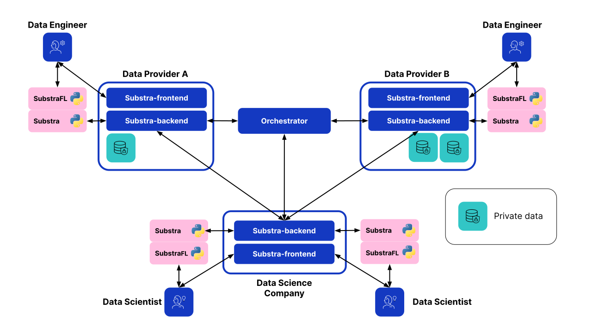

Components
==========

We distinguish two major components, the Orchestrator and the Backend.
Although they are independent, their versions must match a tested release as referenced in the :ref:`compatibility table <compatibility table>`.

.. toctree::
   :glob:
   :titlesonly:
   :caption: Components documentation

   backend/*
   orchestrator/*

