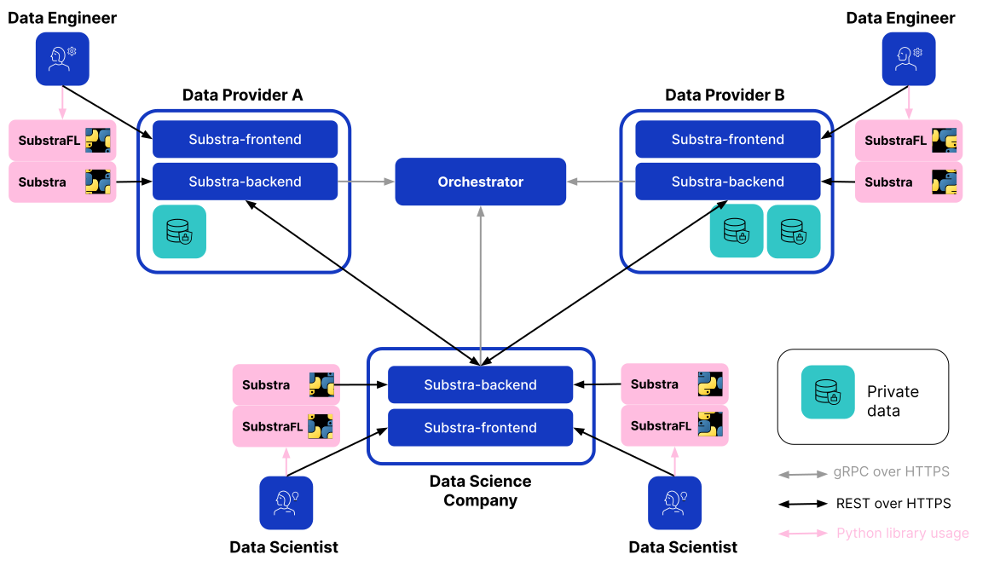

Components
==========

We distinguish two major components, the Orchestrator and the Backend.
Although they are independent, their versions must match a tested release as referenced in the :ref:`compatibility table <compatibility table>`.

You can deploy them in `Kubernetes`_ clusters using `Helm charts`_.

.. _Helm charts: https://helm.sh/docs/topics/charts/
.. _Kubernetes: https://kubernetes.io/

.. toctree::
   :glob:
   :titlesonly:
   :caption: Components documentation

   backend/*
   orchestrator/*

