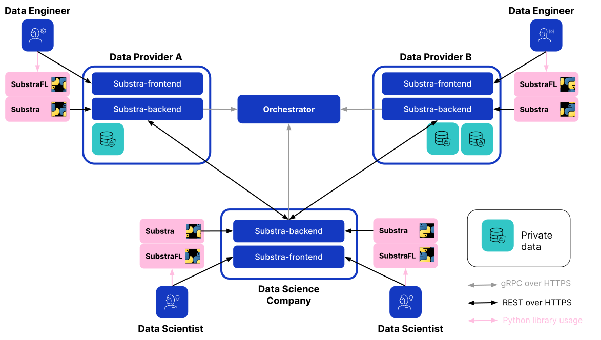

Components
==========

We distinguish two major components, the orchestrator and the backend.
Although they are independent, their versions must match a tested release as referenced in the :ref:`compatibility table <compatibility table>`.

.. toctree::
   :glob:
   :titlesonly:
   :maxdepth: 1
   :caption: Components documentation

   backend/*
   frontend/*
   orchestrator/*
   Substra python library <concepts>
   SubstraFL python library <../substrafl_doc/substrafl_overview>

