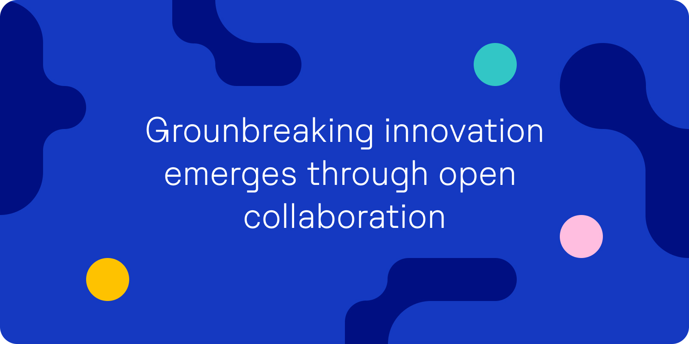

.. Substra documentation master file, created by
   sphinx-quickstart on Mon Aug 30 14:12:40 2021.
   You can adapt this file completely to your liking, but it should at least
   contain the root `toctree` directive.

Substra documentation
=====================

Substra is an open source federated learning framework. It provides a flexible python interface and a web app to run federated learning training at scale.

Substra main usage is a production one. It has already been deployed and used by hospitals and biotech companies (see the `MELLODDY <https://www.melloddy.eu/>`_ project for instance). Yet Substra can also be used on a single machine on a virtually splitted dataset for two use cases:

* debugging code before launching experiments on a real network
* performing FL simulations

Substra was created by `Owkin <https://owkin.com/>`_ and is now hosted by the `Linux Foundation for AI and Data <https://lfaidata.foundation/>`_.

Interfaces
^^^^^^^^^^

Substra has three user interfaces:
    * **Substra**: a low-level Python library (also called SDK). Substra is used to create datasets, algorithms and machine learning tasks on the platform.
    * **Substrafl**: a high-level federated learning Python library based on Substra. Substrafl is used to run complex federated learning experiments at scale.
    * A **web application** used to monitor experiments training and explore their results.

Installation
^^^^^^^^^^^^

Install substra and substrafl with the following command:

.. code-block:: console

    $ pip install substrafl

Substra is a dependency of Substrafl, so it will be automatically installed.

Links
^^^^^

Some quick links:

* :ref:`MNIST federated learning example <substrafl_doc/examples/strategies_examples/plot_substrafl_fedavg:Substrafl FedAvg on MNIST dataset>`
* :ref:`Substrafl overview <substrafl_doc/substrafl_overview:Overview>`
* :ref:`Compatibility table <additional/release:Compatibility table>`
* :ref:`How to deploy Substra for Site Reliability Engineers <operations/deploy:Deploying Substra>`
* :ref:`Community <additional/community:Community>`

.. toctree::
   :glob:
   :maxdepth: 2
   :caption: Substrafl documentation
   :hidden:

   substrafl_doc/index.rst

.. toctree::
   :glob:
   :maxdepth: 2
   :caption: Substra documentation
   :hidden:

   documentation/user_guide.rst
   auto_examples/index
   documentation/api_reference.rst

.. toctree::
   :glob:
   :maxdepth: 1
   :caption: Deploying Substra
   :hidden:

   operations/index.rst
   operations/getting-started.rst
   operations/deploy.rst
   operations/howto.rst
   operations/upgrade_notes.rst

.. toctree::
   :glob:
   :maxdepth: 2
   :caption: Additional Information
   :hidden:

   additional/community.rst
   additional/release.rst
   additional/glossary.rst
