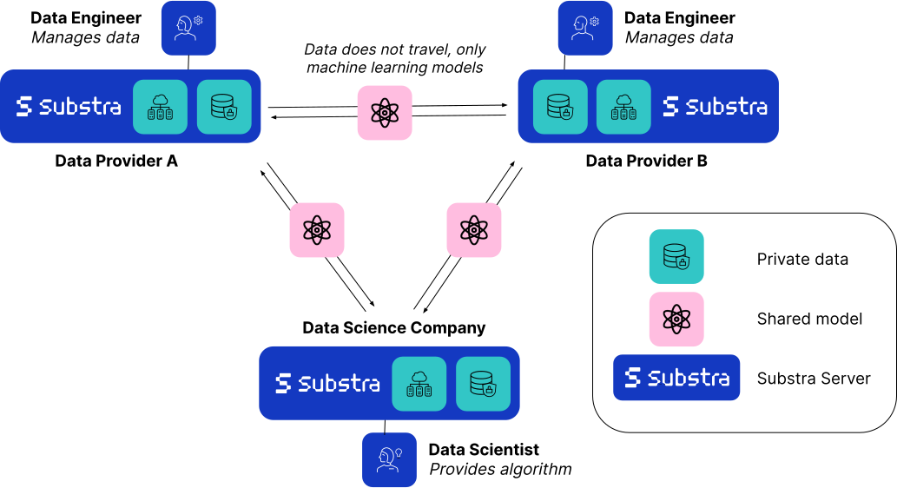

.. Substra documentation master file, created by
   sphinx-quickstart on Mon Aug 30 14:12:40 2021.
   You can adapt this file completely to your liking, but it should at least
   contain the root `toctree` directive.

Substra documentation
=====================

Substra is an open source federated learning (FL) software. It provides a flexible Python interface and a web app to run federated learning training at scale.

Substra's main usage is in production environments. It has already been deployed and used by hospitals and biotech companies (see the `MELLODDY <https://www.melloddy.eu/>`_ project for instance). Substra can also be used on a single machine on a virtually split dataset to perform FL simulations and debug code before launching experiments on a real network.

Substra was created by `Owkin <https://owkin.com/>`_ and is now hosted by the `Linux Foundation for AI and Data <https://lfaidata.foundation/>`_.

How does it work?
^^^^^^^^^^^^^^^^^

Interfaces
^^^^^^^^^^

Substra has three user interfaces:
    * **Substra**: a low-level Python library (also called SDK). Substra is used to create datasets, functions and machine learning tasks on the platform.
    * **SubstraFL**: a high-level federated learning Python library based on Substra. SubstraFL is used to run complex federated learning experiments at scale.
    * A **web application** used to monitor experiments training and explore their results.

Installation
^^^^^^^^^^^^

**Client side**: Install Substra and SubstraFL python libraries with the following command: ``pip install substrafl``. Substra python library is a dependency of SubstraFL, so it will be automatically installed. More information on the installation :ref:`can be found here <substrafl_doc/substrafl_overview:Installation>`.

**Server side**: There are two options to deploy the server side of Substra (backend, frontend and orchestrator):

* :ref:`Local deployment <how-to/developing-substra/local-deployment:Local deployment>`: to deploy locally on a single one machine. Useful for quick tests and for development.
* :doc:`Production deployment <how-to/deploying-substra/index>`: for real deployments.

.. note::
   You can start doing local FL experiments with Substra by installing only the **client side**.

Links
^^^^^

Some quick links:

* :ref:`MNIST federated learning example <examples/substrafl/get_started/run_mnist_torch:Using Torch FedAvg on MNIST dataset>`
* :doc:`SubstraFL overview <substrafl_doc/substrafl_overview>`
* :ref:`Compatibility table <additional/release:Compatibility table>`
* :doc:`How to deploy Substra for Site Reliability Engineers <how-to/deploying-substra/index>`
* :ref:`Community <additional/community:Community>`
* `Subscribe to our newsletter <https://lists.lfaidata.foundation/g/substra-announce/join>`_

.. toctree::
   :glob:
   :maxdepth: 2
   :caption: What is Substra
   :hidden:

   documentation/concepts
   substrafl_doc/substrafl_overview
   documentation/components
   documentation/substra_tools

.. toctree::
   :glob:
   :maxdepth: 2
   :caption: Tutorials
   :hidden:

   examples/substrafl/index
   examples/substra_core/index

.. toctree::
   :glob:
   :maxdepth: 2
   :caption: API Reference
   :hidden:

   substrafl_doc/api/index.rst
   documentation/api_reference.rst

.. toctree::
   :glob:
   :maxdepth: 1
   :caption: How-to guides
   :hidden:

   how-to/using-substra/index.rst
   how-to/deploying-substra/index.rst
   how-to/developing-substra/index.rst

.. toctree::
   :glob:
   :maxdepth: 1
   :caption: Contributing guide
   :hidden:

   contributing/contributing-guide.rst
   contributing/code-of-conduct.rst

.. toctree::
   :glob:
   :maxdepth: 2
   :caption: Additional Information
   :hidden:

   additional/community.rst
   additional/release.rst
   additional/faq.rst
   additional/glossary.rst
