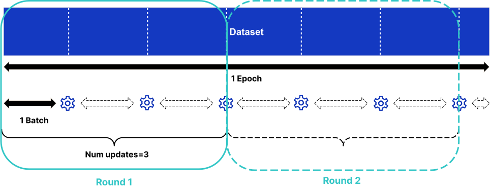

SubstraFL Overview
==================

.. _substrafl_concepts:

SubstraFL is a federated learning Python library that leverages Substra to run federated learning experiments at scale on real distributed data. Its main usage is therefore in production environments. SubstraFL can also be used on a single machine on a virtually splitted dataset for two use cases:

* to debug code before launching experiments on a real network
* to perform FL simulations

SubstraFL uses the Substra library to handle creation and orchestration of tasks. Please note that SubstraFL is planned to be merged with Substra into a single library.

SubstraFL strives to be as flexible and modular as possible. You can easily change one part of the federated learning experiment (for instance, the local training algorithm) without having to change everything else (the federated learning strategy, the metrics, the dataset, etc)

**ML framework compatibility**:
SubstraFL can be used with any machine learning framework (PyTorch, Tensorflow, Scikit-Learn, etc). However, a specific interface has been developed for using PyTorch with SubstraFL, which makes writing PyTorch code simpler than using other frameworks.

Installation
------------

.. _installation:

Substrafl and Substra are compatible with Python versions 3.8, 3.9 and 3.10 on Windows, MacOS and Linux.

.. note::

    Full support on the following OS:
        - **Ubuntu 22.04**
        - **MacOS** (*Intel* or *M1* chip)

    Support on Windows:
        - ``subprocess`` mode is tested on **Windows Server 2022**.
        - ``docker`` mode is not tested for now. Please refer to :ref:`local_mode` to use it.
        - ``remote`` mode is not tested for now.

    Despite Windows not being deeply tested, fell free to :ref:`reach out <additional/community:Community>` if you encounter any issue.

To install SubstraFL run the following command:

.. code-block:: console

    $ pip install substrafl

Substra is a dependency of SubstraFL, so it will be automatically installed.

Main concepts
-------------

Experiment
^^^^^^^^^^

An experiment is made up of all the different pieces required to perform federated learning: the training data, the algorithm used to do the local training, the federated learning strategy, the metric and the test data.
Launching an experiment creates a :ref:`concept_compute_plan`.

Algorithm
^^^^^^^^^

A SubstraFL algorithm contains the local training and predict code along with all associated hyper parameters (batch size, loss, optimizer, etc).

.. _concept_evaluation_strategy:

Evaluation Strategy
^^^^^^^^^^^^^^^^^^^

The evaluation strategy specifies how and when the model is tested. More specifically it defines:

* The data the model is tested on
* On which rounds the model is tested

Metric
^^^^^^

A metric is a function that computes performance by comparing the model's predictions against labelled data.
One or several metrics can be added for an :ref:`concept_evaluation_strategy`.

Index Generator
^^^^^^^^^^^^^^^

The notion of epochs does not fully apply to the FL setting. Usually we don't want to train on a full epoch on each organization at every round, but on a reduced quantity of data to prevent models from different organizations from diverging too much.
In a federated setting, at each round, in each organization, the model is trained for ``num_updates`` batches, with each batch containing ``batch_size`` data points. This is further explained below (See diagram).

At each round, in each organization, the model is trained for ``num_updates`` batches, with each batch containing ``batch_size`` data points.

For instance if you have a dataset of 1000 data points at every organization, if you specify ``num_updates=10`` and ``batch_size=32``, at each round your model trains on 10 x 32 = 320 data points per organization.

The index generator remembers which data has been used in the previous rounds and generates the new batches so that the model is trained on the full dataset (given enough number of rounds and updates). When the whole dataset has been used, the index generator shuffles the data and starts generating batches from the whole dataset again.

  Example with three updates and two rounds

Node
^^^^
There are three types of node:

* TrainDataNode: one of the organizations the local training takes place on, with a set of data samples and an :ref:`opener <concept_opener>` (a script used to load the data from files into memory) used for training.
* TestDataNode: one of the organizations the model evaluation takes place on, with a set of data samples and an opener used for testing.
* AggregationNode: the organization on which the aggregation, if there is one, takes place.

Note that organizations can be of any node type, and can be multiple node types at the same time. For instance one organization can be for one experiment a TrainDataNode and an AggregationNode.

Federated Learning Strategies
^^^^^^^^^^^^^^^^^^^^^^^^^^^^^
A FL strategy describes the journey the model will take on distributed data. The most popular strategy is the Federated Averaging, which is explained below:

* The model trains locally on each organization
* The model aggregates the weight updates from each of these training sessions on an aggregation node
* The averaged weight updates are applied locally at each organization.

Your choice of strategy will likely depend on the model you use. For instance, you can use the Federated Averaging strategy with a deep neural network or with a logistic regression but not with a random forest. Several FL :ref:`substrafl_doc/api/strategies:Strategies` are already implemented in SubstraFL.

Strategies can be centralized or decentralized:

* **Centralized:** During the training, data provider organizations communicate exclusively with one central organization that does the aggregation. Note that one of the data provider organization can also play the role of the central aggregator.
* **Decentralized:** During the training, the organizations communicate between themselves, there is no central organization.

Round
^^^^^
Each round represents one iteration of the training loop in the federated setting. For example, in a centralized federated learning strategy, a round consists of:

* Initializing the same model (architecture and initial weights) on each training organization.
* Each training organization locally trains the model on its own data and calculates the weight updates to send to the aggregator (and sometimes other statistics depending on the strategy).
* The training organizations send the weight updates to the aggregator organization.
* The weight updates are aggregated by the aggregator organization.
* The aggregated organization sends the aggregated updates to the training organizations.
* The training organizations update their model with the aggregated updates.

Now that you have a good overview of SubstraFL, have a look at the :ref:`MNIST example <examples/substrafl/get_started/run_mnist_torch:Using Torch FedAvg on MNIST dataset>`.

Advanced concepts
-----------------

.. warning:: This section is for advanced users who wants to know more on what happens under the Substra hood.

Centralized strategy - workflow
^^^^^^^^^^^^^^^^^^^^^^^^^^^^^^^

The workflow of a centralised strategy, unless specified otherwise, is as follows:

- initialisation round: one train task on each train organization
- then for each round: one aggregate task on the central organization then one train task on each train organization

Steps of an aggregate task:

- Calculate the common shared state from the previous train tasks shared state.

Steps of a train task:

- If there is an aggregate task before: update the model parameters with the shared state
- Train the model on the local data
- Calculate the shared state update
- Reset the model parameters to before the local training
- Output the local state (the model) and the shared state (parameters to aggregate)

So the local state that the train task outputs represents the state of the model just after the aggregation step of a federated learning strategy.
This means that to test the output model of round 1, we can add a test task after the train task of round 1.

This also means that for the final round of the strategy, we do a useless step of training the model on the local data. This is for 2 reasons:

- Be able to implement checkpointing more easily (ie resume the experiment where we left it, feature not yet available)
- Reuse the same function as the other train tasks, which speeds up the execution

For a more detailed example, see the :ref:`Federated Averaging <substrafl_doc/api/algorithms:TorchFedAvgAlgo>` implementation.

Local and shared states
^^^^^^^^^^^^^^^^^^^^^^^

SubstraFL creates :ref:`tasks <concept_task>` for the user in order to ease the implementation of Federated :ref:`Compute Plans <concept_compute_plan>`.

The concept of local and shared state is used in SubstraFL in order to differentiate which information we want to keep locally on an organization, and which information
we want to share with other organizations.

Local state
***********

A local state is a task output or input that goes from a task within an organization to the next task that will be executed on that same organization. A local state
is useful to keep internal states along a Federated Compute Plan within an organization. A local state may be, for instance, a dictionary to be loaded in order to
re-initialize objects and variable to their previous values.

Example of local state for a :ref:`Federated Averaging <substrafl_doc/api/algorithms:TorchFedAvgAlgo>`:

    .. code:: python

        local_state = {
            "model_state_dict": self.model.state_dict(),
            "index_generator": self.index_generator,
            "optimizer_state_dict": self.optimizer.state_dict(),
            "rng_state": torch.get_rng_state(),
        }

Shared state
************

A shared state is a task output or input that is intended to be shared between organizations. A shared state may be, for instance, a dictionary for sending locally computed values to other organizations.

Example of shared state for a :ref:`Federated Averaging <substrafl_doc/api/algorithms:TorchFedAvgAlgo>`:

    .. code:: python

        parameters_update = weight_manager.subtract_parameters(
            parameters=weight_manager.get_parameters(
                model=self.model,
            ),
            parameters_to_subtract=old_parameters,
        )

        shared_state = {
            "n_sample": len(dataset),
            "parameter_update": parameters_update,
        }

Task outputs permissions
^^^^^^^^^^^^^^^^^^^^^^^^

For each kind of tasks there is different outputs with their own permissions. This section will describe the default permissions settings for each kind of task in the FedAvg example.
Note that you can go and change these settings in the code if they don't fit your needs.

Initialisation task
*******************

- local: Model type output. Permissions are available to the creator organization and the organizations with registered test dataset.
- shared: Model type output. Permissions are available to the creator oganization, the organizations with registered test datasets and the organization handling aggregations.

Train task
**********

- local: Model type output. Permissions are available to the creator organization and the organizations with registered test dataset.
- shared: Model type output. Permissions are available to the creator oganization, the organizations with registered test datasets and the organization handling aggregations.

Prediction task
***************

- prediction: Model type output. Permissions are only available to the creator organization.

Test task
**********

- performance: Number type output. Permissions are public, available to all.

Aggregation task
****************

- shared: Model type output. Permissions are available to organizations with train tasks. 