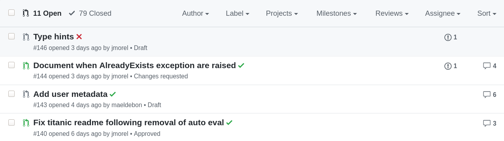

# Contributing to Substra

:+1::tada: First off, thanks for taking the time to contribute! :tada::+1:

The following is a set of guidelines for contributing to the Substra framework, which is hosted on the [Substra Foundation Organization](https://github.com/SubstraFoundation) on GitHub. These are mostly guidelines, not rules. Use your best judgment and feel free to propose changes to this document in a pull request.

- [Contributing to Substra](#contributing-to-substra)
  - [Acknowledgements](#acknowledgements)
  - [Code of Conduct](#code-of-conduct)
  - [I don't want to read this whole thing I just have a question!](#i-dont-want-to-read-this-whole-thing-i-just-have-a-question)
  - [What should I know before I get started?](#what-should-i-know-before-i-get-started)
    - [The components of Substra](#the-components-of-substra)
  - [How Can I Contribute?](#how-can-i-contribute)
    - [Improving the documentation](#improving-the-documentation)
    - [Reporting Bugs](#reporting-bugs)
      - [Before Submitting A Bug Report](#before-submitting-a-bug-report)
      - [How Do I Submit A (Good) Bug Report?](#how-do-i-submit-a-good-bug-report)
    - [Suggesting Enhancements](#suggesting-enhancements)
      - [Before Submitting An Enhancement Suggestion](#before-submitting-an-enhancement-suggestion)
      - [How Do I Submit A (Good) Enhancement Suggestion?](#how-do-i-submit-a-good-enhancement-suggestion)
    - [Your First Code Contribution](#your-first-code-contribution)
      - [Local development](#local-development)
    - [Pull Requests](#pull-requests)
    - [Code review](#code-review)
      - [Review checklist](#review-checklist)
      - [Review best practices](#review-best-practices)
        - [TL;DR](#tldr)
        - [Unhelpful behavior](#unhelpful-behavior)
        - [Helpful Code Review Practices](#helpful-code-review-practices)
  - [Coding guidelines](#coding-guidelines)
    - [Python Coding Guideline](#python-coding-guideline)
    - [Go Coding Guidelines](#go-coding-guidelines)
    - [Third Party Library Usage](#third-party-library-usage)
      - [How to choose the right library?](#how-to-choose-the-right-library)
      - [How to check licence compatibility](#how-to-check-licence-compatibility)
      - [Further reading](#further-reading)
  - [Additional Notes](#additional-notes)
    - [Issue and Pull Request Labels](#issue-and-pull-request-labels)
      - [Type of Issue and Issue State](#type-of-issue-and-issue-state)
      - [Topic Categories](#topic-categories)
      - [Pull Request Labels](#pull-request-labels)
  - [Security Policy](#security-policy)

___

## Acknowledgements

This amazing piece of software has been developed and open sourced by [Owkin](https://owkin.com/) and its [terrific software engineers](https://github.com/SubstraFoundation/substra/graphs/contributors). The repositories are now maintained by [Substra Foundation](https://github.com/SubstraFoundation) and its community. Besides, Substra is really excited to welcome new members, feedbacks and contributions, so please, feel free to get in touch with us!

## Code of Conduct

This project and everyone involved is governed by the Code of Conduct defined [here](https://github.com/SubstraFoundation/.github/CODE_OF_CONDUCT.md). By participating, you are expected to uphold this code. Please report unacceptable behavior to [github@substra.ai](mailto:github@substra.ai).

## I don't want to read this whole thing I just have a question!

Please check [our forum](https://forum.substra.org/), [create an issue](https://github.com/SubstraFoundation/substra-documentation/issues/new) or drop us an [email](mailto:help@substra.ai).

## What should I know before I get started?

It might be useful to have a look at the [documentation](https://doc.substra.ai)!

### The components of Substra

Substra is made of several open source components listed below. When you initially consider contributing to Subtra, you may be unsure of the component that implements the functionality you want to change or report a bug for. The table below should help you with that.

| Component  | Goal  |
|---|---|
| [substra](https://github.com/SubstraFoundation/substra) | Documentation, CLI and Python SDK to interact with a Substra node.  |
| [substra-tools](https://github.com/SubstraFoundation/substra-tools) | Toolkit to design assets to be registered to Substra.  |
| [substra-frontend](https://github.com/SubstraFoundation/substra-frontend)  | Frontend to visualize the state of the assets registered to a Substra channel.  |
| [substra-ui](https://github.com/SubstraFoundation/substra-ui)  | UI component for the frontend.  |
| [substra-backend](https://github.com/SubstraFoundation/substra-backend)  | Backend of a Substra node.  |
| [substra-chaincode](https://github.com/SubstraFoundation/substra-chaincode)  | Smart contracts responsible for the decentralized orchestration.  |
| [hlf-k8s](https://github.com/SubstraFoundation/hlf-k8s)  | Tools to deploy a Hyperledger Fabric network on kubernetes.  |
| [substra-tests](https://github.com/SubstraFoundation/substra-tests)  | Tests for the framework Substra.  |

## How Can I Contribute?

### Improving the documentation

The documentation can be found [here](https://github.com/SubstraFoundation/substra-documentation/).
We believe documentation is key to a great project and that it should be as alive as our project, so please, do not hesitate to submit any feedback or PR to improve it!

### Reporting Bugs

This section guides you through submitting a bug report for Substra. Following these guidelines helps maintainers and the community understand your report :pencil:, reproduce the behavior :computer: :computer:, and find related reports :mag_right:.

Before creating bug reports, please check [this list](#before-submitting-a-bug-report) as you might find out that you don't need to create one. When you are creating a bug report, please [include as many details as possible](#how-do-i-submit-a-good-bug-report). Fill out [the required template](https://github.com/SubstraFoundation/.github/blob/master/.github/ISSUE_TEMPLATE/bug_report.md), the required information will help us resolve issues faster.

> **Note:** If you find a **Closed** issue that seems like it is the same thing that you're experiencing, open a new issue and include a link to the original issue in the body of your new one.

#### Before Submitting A Bug Report

- **Determine [in which repository the problem should be reported](#the-components-of-substra)**.
- **Perform a [cursory search](https://github.com/search?q=+is%3Aissue+org%3Asubstrafoundation)** to see if the problem has already been reported. If it has **and the issue is still open**, please kindly add a comment to the existing issue instead of opening a new one.

#### How Do I Submit A (Good) Bug Report?

Bugs are tracked as [GitHub issues](https://guides.github.com/features/issues/). After you've determined [which repository](#the-components-of-substra) your bug is related to, create an issue on that repository. This template should guide you to submit a good bug report.

If you really don't know which repository your bug is related to, submit an issue [here](https://github.com/SubstraFoundation/substra/issues/new).

### Suggesting Enhancements

This section guides you through submitting an enhancement suggestion for Substra, ranging from minor improvements for already existing functionality to completely new features. Following these guidelines will help maintainers and the community understand your suggestion :pencil: and find related suggestions :mag_right:.

Before creating enhancement suggestions, please check [this list](#before-submitting-an-enhancement-suggestion) as you might find out that you don't need to create a new one. When you are creating an enhancement suggestion, please [include as many details as possible](#how-do-i-submit-a-good-enhancement-suggestion). Fill in [the template](https://github.com/SubstraFoundation/.github/blob/master/.github/ISSUE_TEMPLATE/feature_request.md), including all the steps that you imagine you would take if the feature already existed.

You can also start a new topic on the [forum](https://forum.substra.org/) in order to engage the community in discussing your suggestion.

#### Before Submitting An Enhancement Suggestion

- **Check if there is a newer version which already provides this enhancement.**
- **Determine [which repository the enhancement should be suggested in](#the-components-of-substra).**
- **Perform a [cursory search](https://github.com/search?q=+is%3Aissue+org%3Asubstrafoundation)** to see if the enhancement has already been suggested. If it has, please kindly add a comment to the existing issue instead of opening a new one.

#### How Do I Submit A (Good) Enhancement Suggestion?

Enhancement suggestions are tracked as [GitHub issues](https://guides.github.com/features/issues/). After you've determined [which repository](#components-of-substra) your enhancement suggestion is related to, create an issue on that repository. The template should guide you to submit a good enhancement suggestion.

If you don't know which repository your suggestion is related to, submit an issue to [here](https://github.com/SubstraFoundation/substra/issues/new).

### Your First Code Contribution

Not sure where to start?

You can have a look through these [[Beginner]](https://github.com/search?q=is%3Aopen+is%3Aissue+label%3Abeginner+org%3Asubstrafoundation+sort%3Acomments-desc&type=Issues) and [[Help-wanted]](https://github.com/search?q=is%3Aopen+is%3Aissue+label%3Ahelp-wanted+org%3Asubstrafoundation+sort%3Acomments-desc) flagged issues:

- `[Beginner]` issues are issues that should only require a few lines of code, and a test or two.
- `[Help wanted]` issues are issues that should be a bit more involved than beginner issues.

Both issues lists are sorted by total number of comments. While not perfect, the number of comments is a reasonable proxy for impact a given change will have.

> Note: `translation` or `reformulation` can be good entry points on the project.

#### Local development

Substra can be developed locally. For instructions on how to do this, see [this page](https://doc.substra.ai/getting_started/installation/local_install_skaffold.html) which is part of the Substra Documentation.

### Pull Requests

> Hint: Before starting a Pull Request, opening an issue is a good way to reach the team involved (most likely the reviewers of your submission) and discuss your proposition!

The process described here has several goals:

- Maintain the quality of Substra
- Fix problems that are important to users
- Engage the community in working toward the best possible Substra
- Enable a sustainable system for Substra's maintainers to review contributions

Please follow these steps to have your contribution considered by the maintainers:

1. Follow the [coding guidelines](#coding-guidelines)
1. After submitting your pull request, verify that all [status checks](https://help.github.com/articles/about-status-checks/) are passing.

For example, in this caption of the open Pull Requests on the main Substra repository, we can see that:

- The Pull Request called "Type hints" is not passing tests
- Others are passing

What if the status checks are failing?

If a status check is failing, and you believe that the failure is unrelated to your change, please leave a comment on the pull request explaining why you believe the failure is unrelated. A maintainer will re-run the status check for you. If we conclude that the failure was a false positive, then we will open an issue to track that problem with our status check suite.

While the prerequisites above must be satisfied prior to having your pull request reviewed, reviewer(s) may ask you to complete additional design work, tests, or other changes before your submission can be ultimately accepted.

> Note: In order to ease the process, please consider creating a **specific branch** with an explicit name pointing towards the `master`branch. You might even `fork` the whole repository and then open a Pull Request using `compare accross forks`. Please refer to [Github documentation](https://help.github.com/en/github/collaborating-with-issues-and-pull-requests/creating-a-pull-request-from-a-fork) for further information.

### Code review  

Reviewing code is a crucial component of the development of the project. We strongly encourage anyone to start reviewing code of other developers as it often is highly educational for everyone involved.

#### Review checklist

Please make sure you went through this checklist:

- Does this code read like prose?
- Do the methods do what their name claims they will do? Same for classes?
- Is the code as modular as possible?
- Can I get an understanding of the desired behavior just by doing quick scans through unit and acceptance tests?
- Does the understanding of the desired behavior match the requirements/stories for this work?
- If there is a small doubt on the fact that acceptance tests might not be enough? Have I tested that it works?
- Is this code introducing any new dependencies between classes/components/modules and, if so, is it necessary to do that?
- Is this code idiomatic, taking full advantage of the language, frameworks and tools we use?
- Is anything here a re-implementation of existing functionality the developer may not be aware of?

#### Review best practices

Please make sure to be **as constructive as possible**. This article summarises unhelpful and helpful behaviors when doing a code review: [Unlearning toxic behaviors in a code review culture](https://medium.com/@sandya.sankarram/unlearning-toxic-behaviors-in-a-code-review-culture-b7c295452a3c):

##### TL;DR

##### Unhelpful behavior

- Don’t make claims unless you can cite documentation, formalized guidelines and coding examples to back those claims up.

Instead of saying:

> This component should be stateless.

Provide some context behind the recommendation:

> Since this component doesn’t have any lifecycle methods or state, it could be made a stateless functional component. This will improve performance and readability. *Here* is some documentation.

- Don't ask judgmental questions.

Avoid asking questions like:

> Why didn’t you just do ___ here?

Oftentimes, these judgmental questions are just veiled demands. Instead, provide a recommendation (with documentation and citations) and leave out harsh words.

> You can do ___ which has the benefit of ___.

- Avoid being sarcastic.

Unhelpful:

> Did you even test this code before you checked it in?

Helpful:

> This breaks when you enter a negative number. Can you please address this case?

- Don't ask engineers to solve problems they didn’t cause “while they are at it”.

If the code solves the issue/ticket the dev was working on and doesn’t introduce any new issues to the codebase, give the pull request a “thumbs up” and then create a ticket to clean up the existing bad code.

- Don’t ghost people.

##### Helpful Code Review Practices

- Use questions or recommendations to drive dialog
- Collaborate, don’t back-seat drive
- Respond to every comment
- Know when to take a discussion offline

> The kinds of problems that take hours and tons of comments can usually be resolved in a few minutes of productive talk. — Tidy Java

- Use opportunities to teach, and don’t show off

> Before choosing to participate in a code review, ask yourself:

Is your comment helping the other developer learn or are you nitpicking to participate?

- Don’t show surprise. Don’t make people feel bad that they “should already have known” this piece of information, cf. [feigned surprise](https://www.recurse.com/manual#no-feigned-surprise).

## Coding guidelines

**This section points to standard guides we try to follow in the Substra project.**

### Python Coding Guideline

- Our **libraries** supports python 3.6 and newer
- Our **applications** are written for python 3.6

The Substra project tries to closely follow the official Python guideleines detailed in [PEP8](https://www.python.org/dev/peps/pep-0008/). Please read it and follow it.

You can check your code using [flake8](http://flake8.pycqa.org/en/latest/).

In addition, please apply the following guidelines:

- Line length up to 119 characters, contrary to the PEP8 guidelines. PEP8 recommends a 79 char limit, but we believe that sometimes it makes the code harder to read.
- Use double quote `"` when a string contains single or double quote characters, however, use the other one to avoid backslashes in the string.
- String formatting: use [f-strings](https://www.python.org/dev/peps/pep-0498/)
- Docstings: [PEP-257](https://www.python.org/dev/peps/pep-0257/) says that "The docstring for a function or method should summarize its behavior and document its arguments, return value(s), side effects, exceptions raised, and restrictions. However, it doesn't specify any details of what this should look like. Fortunately, the Google python style guide provides a [reasonable syntax for arguments and return values](https://github.com/google/styleguide/blob/gh-pages/pyguide.md#38-comments-and-docstrings).
- Avoid use of “we” in comments, e.g. “Loop over” rather than “We loop over”.
- When contributing to existing projects - do not change the style.

### Go Coding Guidelines

The Substra project tries to follow the following resources:

- [Effective Go](https://golang.org/doc/effective_go.html)
- [Go Code Review Comments](https://github.com/golang/go/wiki/CodeReviewComments)

### Third Party Library Usage

There are several advantages of using third party libraries:

- Saving time
- Not reinventing the iPhone
- Using tested code
- Using modular code

But there are also some disadvantages:

- Dependencies
- Lack of Support
- Overuse
- Security Issues

#### How to choose the right library?

To maximise advantages over disadvantages, please carefully consider the following questions:

- Is this library going to be used for core features?
- Is the library maintained?
  - Release frequency, number of issues, pull requests could be good indicators.
- How popular is the library?
  - Ecosystem and community (stars on github, stackoverflow discussions, etc), you can also [check fake stars on Github](https://github.com/Ullaakut/astronomer).
  - Blog posts.
  - Who use the library at scale?
- How reliable is the author?
- How well-written is the library?
  - The library meet common langage good practicies.
  - The library have tests and is well documented.
- Does the library meet your specific requirements?
- Does the library have the correct license?
- Is library Licence compatible with our project and licences policies?
- Is there a security policy defined in the project?

#### How to check licence compatibility

The Substra project is license under a Apache 2.0 license. **Libraries used in the project must thus be [permissive licenses](https://www.wikiwand.com/en/Permissive_software_license)**.

#### Further reading

- [Licence List](https://www.gnu.org/licenses/license-list.html)
- [Check Legal](https://tldrlegal.com)
- [Floss License Slide](https://dwheeler.com/essays/floss-license-slide.pdf)
- [Managing Security Risks Inherent in the Use of Thirdparty Components](https://safecode.org/wp-content/uploads/2017/05/SAFECode_TPC_Whitepaper.pdf)

## Additional Notes

### Issue and Pull Request Labels

This section lists the labels we use to help us track and manage issues and pull requests. These labels are used across all Substra repositories.

[GitHub search](https://help.github.com/articles/searching-issues/) makes it easy to use labels for finding groups of issues or pull requests you're interested in.

The labels are loosely grouped by their purpose, but it's not required that every issue have a label from every group or that an issue can't have more than one label from the same group.

Please open an issue with a `Add_Label` flag, define if you have suggestions for new labels, and if you notice some missing labels on some repositories, then please open an issue on that repository.

#### Type of Issue and Issue State

| Label name | :mag_right: | Description |
| --- | --- | --- |
| `enhancement` | [search](https://github.com/search?q=is%3Aopen+is%3Aissue+org%3Asubstrafoundation+label%3Aenhancement) | Feature requests. |
| `bug` | [search](https://github.com/search?q=is%3Aopen+is%3Aissue+org%3Asubstrafoundation+label%3Abug) | Confirmed bugs or reports that are very likely to be bugs. |
| `question` | [search](https://github.com/search?q=is%3Aopen+is%3Aissue+org%3Asubstrafoundation+label%3Aquestion) | Questions more than bug reports or feature requests (e.g. how do I do X). |
| `feedback` | [search](https://github.com/search?q=is%3Aopen+is%3Aissue+org%3Asubstrafoundation+label%3Afeedback) | General feedback more than bug reports or feature requests. |
| `help-wanted` | [search](https://github.com/search?q=is%3Aopen+is%3Aissue+org%3Asubstrafoundation+label%3Ahelp-wanted) | The Atom core team would appreciate help from the community in resolving these issues. |
| `beginner` | [search](https://github.com/search?q=is%3Aopen+is%3Aissue+org%3Asubstrafoundation+label%3Abeginner) | Less complex issues which would be good first issues to work on for users who want to contribute to Atom. |
| `more-information-needed` | [search](https://github.com/search?q=is%3Aopen+is%3Aissue+org%3Asubstrafoundation+label%3Amore-information-needed) | More information needs to be collected about these problems or feature requests (e.g. steps to reproduce). |
| `needs-reproduction` | [search](https://github.com/search?q=is%3Aopen+is%3Aissue+org%3Asubstrafoundation+label%3Aneeds-reproduction) | Likely bugs, but haven't been reliably reproduced. |
| `blocked` | [search](https://github.com/search?q=is%3Aopen+is%3Aissue+org%3Asubstrafoundation+label%3Ablocked) | Issues blocked on other issues. |
| `duplicate` | [search](https://github.com/search?q=is%3Aopen+is%3Aissue+org%3Asubstrafoundation+label%3Aduplicate) | Issues which are duplicates of other issues, i.e. they have been reported before. |
| `wontfix` | [search](https://github.com/search?q=is%3Aopen+is%3Aissue+org%3Asubstrafoundation+label%3Awontfix) | The Atom core team has decided not to fix these issues for now, either because they're working as intended or for some other reason. |
| `invalid` |  [search](https://github.com/search?q=is%3Aopen+is%3Aissue+org%3Asubstrafoundation+label%3Ainvalid) | Issues which aren't valid (e.g. user errors). |
| `wrong-repo` | [search](https://github.com/search?q=is%3Aopen+is%3Aissue+org%3Asubstrafoundation+label%3Awrong-repo) | Issues reported on the wrong repository.  |

#### Topic Categories

| Label name | :mag_right: | Description |
| --- | --- | --- |
| `documentation` | [search](https://github.com/search?q=is%3Aopen+is%3Aissue+org%3Asubstrafoundation+label%3Adocumentation) | Related to any type of documentation. |
| `security` | [search](https://github.com/search?q=is%3Aopen+is%3Aissue+org%3Asubstrafoundation+label%3Asecurity) | Related to security. |

#### Pull Request Labels

| Label name | :mag_right: | Description
| --- | --- | --- |
| `work-in-progress` | [search](https://github.com/search?q=is%3Aopen+is%3Apr+org%3Asubstrafoundation+label%3Awork-in-progress) | Pull requests which are still being worked on, more changes will follow. |
| `needs-review` | [search](https://github.com/search?q=is%3Aopen+is%3Apr+org%3Asubstrafoundation+label%3Aneeds-review) | Pull requests which need code review, and approval from maintainers or Atom core team. |
| `under-review` | [search](https://github.com/search?q=is%3Aopen+is%3Apr+org%3Asubstrafoundation+label%3Aunder-review) | Pull requests being reviewed by maintainers or Atom core team. |
| `requires-changes` | [search](https://github.com/search?q=is%3Aopen+is%3Apr+org%3Asubstrafoundation+label%3Arequires-changes) | Pull requests which need to be updated based on review comments and then reviewed again. |
| `needs-testing` | [search](https://github.com/search?q=is%3Aopen+is%3Apr+org%3Asubstrafoundation+label%3Aneeds-testing) | Pull requests which need manual testing. |

## Security Policy

Please refer to [this section](../../../.github/SECURITY.md) if you want to submit any security related issue.
